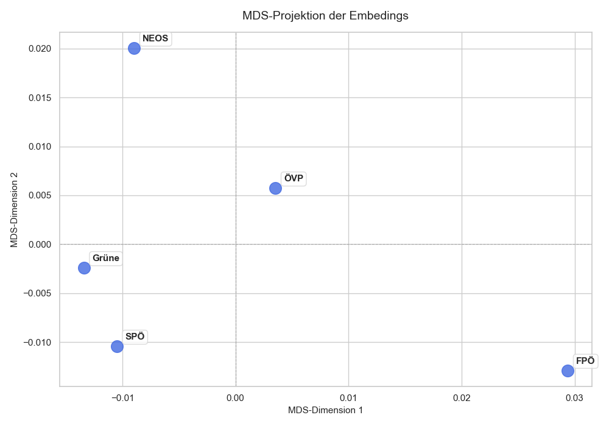
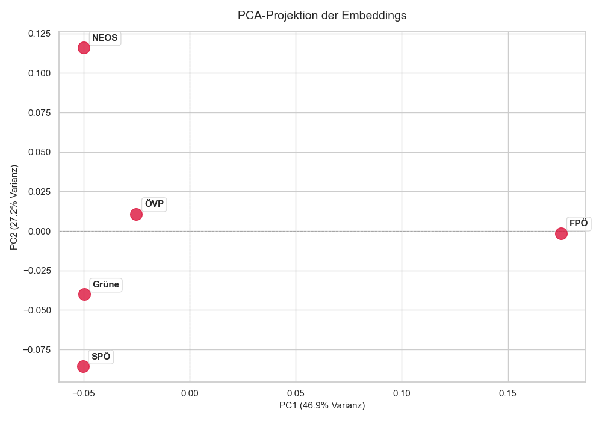

# Semantic Analysis with Embeddings of Austrian Political Party Programms (Grundsatzprogram)

This Script compares the semantic similarity of the Party Programs of all bis Austrian political partys. 
From the programms, stored in Dokumente, an embedding is calculated and stored in Chroma DB. 

This is done with

``embed_dokumente.py``

In a second step with

``distance_embeddings.py``

a semantic similarity analysis is done, by several steps. This will produce the graphics in section results.

## Results

### Cosinus-Distanzmatrix

The average of the embedding vector per party is calculated. Then the Cosine distance matrix 
The smaller the value the smaller the value the smaller the semantic distance.

|       |FPÖ        | Grüne    |NEOS     |SPÖ      |ÖVP    |
|-------|-----------|----------|---------|---------|-------|    
|FPÖ    | 0.0000    | 0.0401   | 0.0460  | 0.0420  | 0.0384|
|Grüne  | 0.0401    | 0.0000   | 0.0221  | 0.0104  | 0.0226|
|NEOS   | 0.0460    | 0.0221   | 0.0000  | 0.0305  | 0.0240|
|SPÖ    | 0.0420    | 0.0104   | 0.0305  | 0.0000  | 0.0192|
|ÖVP    | 0.0384    | 0.0226   | 0.0240  | 0.0192  | 0.0000|

## Dimension Reduction

 Dimension reduction on the embedings is applied. This allows to express the similarity of the texts visually, by reducing the dimensionallity of the embeding vectors. The Closer the observations the more similar are these observations.
 
  Two methods are used for comparison. Multidimensional scaling (MDS) and PCA. It is necessary to keep in mind that a position of the observation points left or right or up/down does not indicate a political position in the left/right spectrum of the partys. MDS and PCA have in terms of position of the points a random element and are not aware of political categorys, the only factor that matters is the distance of the observations with respect to each other. Both methods produce, in terms of similiar position of the observations to each other a somewhat similiar output.

